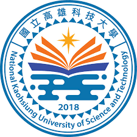

# 邱子權

## 關於我

專長
* **玩**
* 睡
* 吃
  
座右銘：*活在當下*

[NKUST](https://www.nkust.edu.tw/)


> 不必做就不要做

 | 任務名稱 | 狀態 | 負責人 | 截止日期 | 
 |---|:---:|:---:|---:|
 | 需求分析 | 完成 | 小明 | 2023-01-15 |
 | 資料庫設計 | 進行中 | 小華 | 2023-01-30 | 
 | 前端介面 | 未開始 | 小李 | 2023-02-15 |

```python=
print("Hello, Markdown!")
print("Hello, Markdown!")
```

